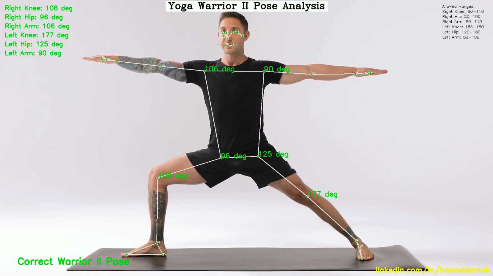

# Yoga Warrior II Pose Analysis

A computer vision application that analyzes the Warrior II (Virabhadrasana II) yoga pose using MediaPipe Pose estimation. This project provides real-time feedback on pose accuracy by measuring key joint angles.



Current angle measurements in the image:
- Right Knee: 108°
- Right Hip: 97°
- Right Arm: 104°
- Left Knee: 177°
- Left Hip: 124°
- Left Arm: 89°

## Features

- **Real-time Pose Analysis**: Analyzes 6 critical angles in Warrior II pose
- **Visual Feedback**: Color-coded angle display (green for correct, red for incorrect)
- **Audio Alerts**: Beep sound for incorrect pose
- **Data Logging**: Saves all measurements to CSV file
- **Professional UI**: 
  - Title display
  - Allowed range indicators
  - Current angle measurements
  - Frame counter
  - Professional branding

## Angle Measurements

| Joint | Allowed Range (degrees) | Description |
|-------|------------------------|-------------|
| Right Knee | 80-110° | Front knee bend |
| Right Hip | 80-100° | Front hip alignment |
| Right Arm | 80-110° | Right arm position |
| Left Knee | 165-180° | Back leg straightness |
| Left Hip | 120-180° | Back hip alignment |
| Left Arm | 80-100° | Left arm position |

## Requirements

```
python >= 3.9
opencv-python >= 4.5.0
numpy >= 1.19.0
mediapipe >= 0.8.0
```

## Installation

1. Clone the repository:
```bash
git clone https://github.com/hamedsamak/yoga-warrior-analysis.git
cd yoga-warrior-analysis
```

2. Install dependencies:
```bash
pip install -r requirements.txt
```

## Usage

1. Place your video file named "1.mp4" in the project directory
2. Run the program:
```bash
python Yoga.py
```

## Output Files

- **Video Output**: `warrior_full_analysis_v3.mp4`
  - Shows pose detection
  - Displays angle measurements
  - Color-coded feedback
  - Frame counter
  
- **Data Log**: `angles_log_v3.csv`
  - Frame-by-frame angle measurements
  - Pose status (Correct/Incorrect)
  - Timestamp data

## Code Structure

- `Yoga.py`: Main application file
  - Video processing
  - Pose detection
  - Angle calculations
  - Visual feedback
  - Data logging

## Project Directory Structure

```
yoga-warrior-analysis/
├── assets/
│   └── warrior_pose_analysis.png
├── Yoga.py
├── README.md
├── requirements.txt
└── LICENSE.md
```

## Technical Details

### MediaPipe Configuration
```python
min_detection_confidence=0.7
min_tracking_confidence=0.7
model_complexity=2
```

### Key Features
- Real-time pose detection
- Angle calculation using vector mathematics
- CSV data logging
- Audio-visual feedback
- Professional UI elements

## Author

**Hamed Samak**
- LinkedIn: [linkedin.com/in/hamedsamak](https://linkedin.com/in/hamedsamak)

## License

This project is licensed under the MIT License - see the [LICENSE](LICENSE.md) file for details.

---

For questions and contributions, please feel free to reach out on LinkedIn.